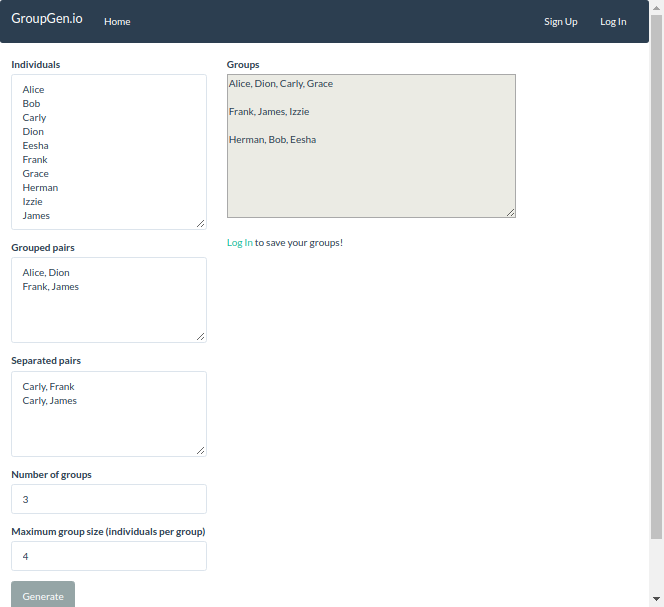

# GroupGen

[Groupgen.io](http://www.groupgen.io) is a web application to help educators create groups and seating charts!

The website allows explicit grouping and separation of individuals, control of the maximum group size, and the number of groups/tables.

By registering an account and logging in, you are able to save and load your classes to easily create new groups in the future!
